# 酷洛米记账系统前端

基于 `ContiNew Admin UI 4.2.0-SNAPSHOT` 二次开发的前端项目，当前已经从通用后台模板演进为一套可同时支撑 Web 端和移动端 H5 的酷洛米记账系统前端。

当前版本重点是：

1. Web 端记账主流程已可稳定使用。
2. `/m` 移动端独立页面体系已落地。
3. 专属入口登录与静默续登链路已接通。
4. 科目标签、支付账号、是否必要收支等记账扩展能力已打通。
5. Web 报表中心、Web 日历报表、移动端报表页面已落地。
6. 验证码、隐私模式、用户管理、在线用户展示等配套能力已打通。

当前前端展示版本号：

`v1.2.0`

---

## ✨ 项目初衷

本项目的出发点，不只是“把账记下来”，而是想解决现实生活里一个很真实的问题：

**很多人需要一套既能完整记账、又能保护个人财务边界的系统。**

酷洛米记账系统更关注的是：

1. 让用户能看到自己真正的资金流向和财务状态。
2. 在共享记账、家庭记账、多用户查看的场景下，保留个人账本空间与展示边界。
3. 通过隐私模式、隐藏明细、独立视角等能力，把“完整记账”和“个人财务自主”同时兼顾起来。

换句话说，这套系统不是单纯做一个流水记录工具，而是希望把：

1. 个人财务掌控感
2. 家庭共享协作
3. 隐私边界管理

这三件事放进同一个系统里。

---

## 🧭 项目定位

本项目不是简单套壳的管理后台，而是当前酷洛米记账系统的前端主仓库，负责：

1. Web 端管理后台页面
2. `/m` 移动端独立页面
3. 登录、权限、专属入口、隐私模式等前端交互
4. 与后端共用的记账 API 对接

设计原则如下：

1. Web 端和移动端页面分开开发，不强行共用页面结构。
2. 公共 API、Store、Hook、工具方法尽量复用。
3. 移动端优先使用 `TDesign Mobile Vue`。
4. Web 端继续使用 `Arco Design Vue`。

---

## ✅ 当前已完成功能

### 🖥️ Web 端

当前 Web 端已完成以下能力：

1. 科目管理
2. 明细管理
3. 关注关系管理
4. 隐藏对象配置
5. 隐私密码与隐私时长配置
6. 用户管理中的专属入口维护
7. 在线用户中的登录方式与快捷登录标识展示
8. 网站配置中的前台域名维护

其中记账相关已经具备：

1. 分类、科目、标签、支付方式、支付账号、是否必要、所属用户等维度查询
2. 明细统计区总支出、总收入、结余展示
3. 科目图标选择器与图标字段录入
4. 明细新增、编辑、删除完整链路
5. 支付账号管理页与明细弹窗联动选择
6. Web 报表中心、明细排行、标签排行、日历报表

### 📱 移动端

当前移动端已完成以下能力：

1. 独立 `/m` 路由入口与终端映射
2. 独立移动端布局与底部导航
3. `/m/bookkeeping/detail` 明细主页
4. `/m/report` 移动端报表页
5. `/m/me` 我的页面
6. `/m/subject` 科目页

当前移动端明细主链路已完成：

1. 月份切换
2. 用户筛选
3. 收支汇总展示
4. 独立新增 / 编辑记账交互
5. 科目与支付方式弹层即时选择并关闭
6. 支付账号选择、是否必要选择、标签化展示
7. 自定义金额键盘
8. 隐私模式入口与状态联动
9. 骨架屏、回到顶部、移动端 Toast

当前移动端报表已完成：

1. 时间预设切换
2. 用户维度切换
3. 支付账号 chips 筛选
4. 概览卡片、趋势图、分类占比、科目排行、标签排行、支付方式分布、用户对比、洞察面板

### 🔐 登录与安全链路

当前前端已完成以下登录安全能力：

1. 账号密码登录支持按后端配置动态启用图形验证码
2. 登录页支持专属入口登录
3. 前端本地保存 `entryKey`
4. Token 失效后自动静默续登
5. 被强制下线或手动退出时自动清理本地专属入口信息
6. 在线用户列表可区分普通登录和专属入口登录

---

## 🧱 技术栈

核心技术栈如下：

1. Vue 3
2. TypeScript
3. Vite 5
4. Pinia
5. Vue Router
6. Arco Design Vue
7. TDesign Mobile Vue
8. ECharts
9. Sass

说明：

1. Web 端图表和后续报表模块统一采用 `ECharts + vue-echarts`
2. 移动端不额外引入第二套图表框架

---

## 🗂️ 目录结构

```text
kuromi-bookkeeping-frontend
├─ public
├─ scripts
│  └─ bump-version.mjs
├─ src
│  ├─ apis
│  │  ├─ auth
│  │  ├─ bookkeeping
│  │  ├─ monitor
│  │  └─ system
│  ├─ components
│  │  ├─ BookkeepingSubjectIconSelector
│  │  ├─ Chart
│  │  └─ Verify
│  ├─ config
│  │  └─ app-version.ts
│  ├─ hooks
│  ├─ layout
│  │  └─ mobile
│  ├─ router
│  │  └─ terminal.ts
│  ├─ stores
│  │  └─ modules
│  ├─ styles
│  ├─ utils
│  └─ views
│     ├─ bookkeeping
│     ├─ login
│     ├─ mobile
│     ├─ monitor
│     └─ system
├─ package.json
└─ README.md
```

关键目录说明：

1. `src/views/bookkeeping`
   - Web 端记账页面
2. `src/views/mobile`
   - 移动端页面
3. `src/apis/bookkeeping`
   - 记账模块前端接口封装
4. `src/layout/mobile`
   - 移动端布局、底部导航、全局挂载组件
5. `src/utils/auth.ts`
   - token 与专属入口本地存储能力
6. `src/utils/http.ts`
   - 401、静默续登、请求重放等拦截逻辑

---

## 🧩 关键页面与路由

### 🖥️ Web 端核心页面

1. `/bookkeeping/subject`
   - 科目管理
2. `/bookkeeping/subject-tag`
   - 科目标签管理
3. `/bookkeeping/payment-account`
   - 支付账号管理
4. `/bookkeeping/detail`
   - 明细管理
5. `/bookkeeping/report`
   - 报表中心
6. `/bookkeeping/report-calendar`
   - 日历报表
7. `/bookkeeping/follow`
   - 关注关系管理
8. `/bookkeeping/hide-target`
   - 隐藏对象配置
9. `/system/user`
   - 用户管理，包含专属入口维护
10. `/system/config`
   - 系统配置，包含前台域名
11. `/monitor/online`
   - 在线用户，包含登录方式与快捷登录标识

### 📱 移动端核心页面

1. `/m/bookkeeping/detail`
   - 移动端明细首页
2. `/m/report`
   - 移动端报表首页
3. `/m/subject`
   - 移动端科目页
4. `/m/me`
   - 移动端我的页面

终端默认映射定义在：

- `src/router/terminal.ts`

当前默认移动端首页：

`/m/bookkeeping/detail`

---

## 🖼️ 页面效果展示

以下效果图按当前功能顺序展示，图片资源统一维护在仓库内的 `.image/readme` 目录。

### 🖥️ Web 端效果图

#### Web 端登录

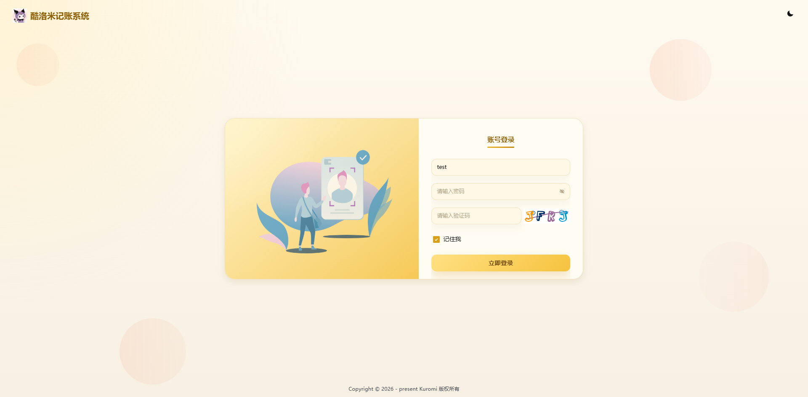

#### Web 端科目管理

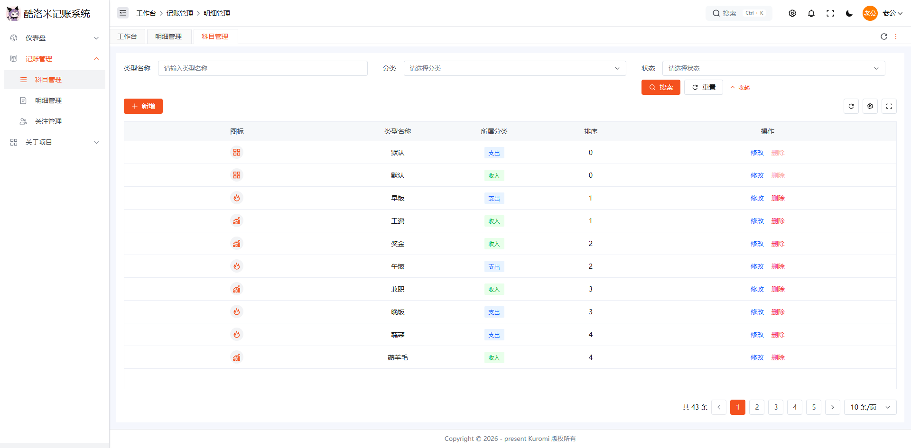

#### Web 端图标管理

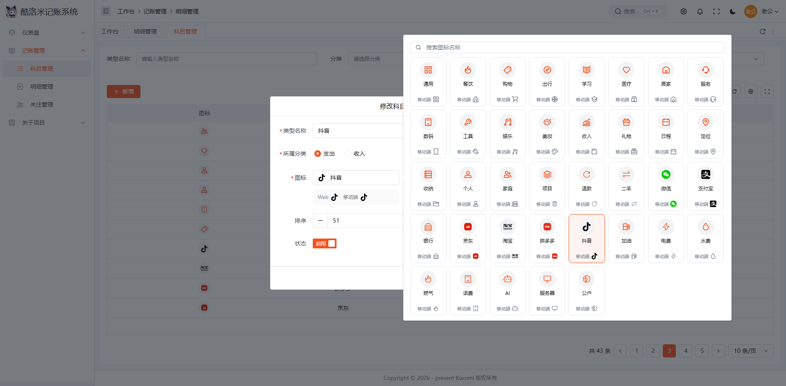

#### Web 端关注管理（一）

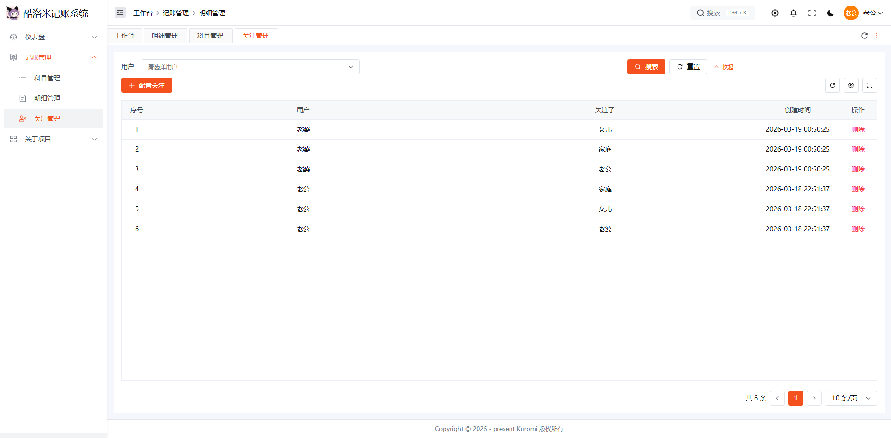

#### Web 端关注管理（二）

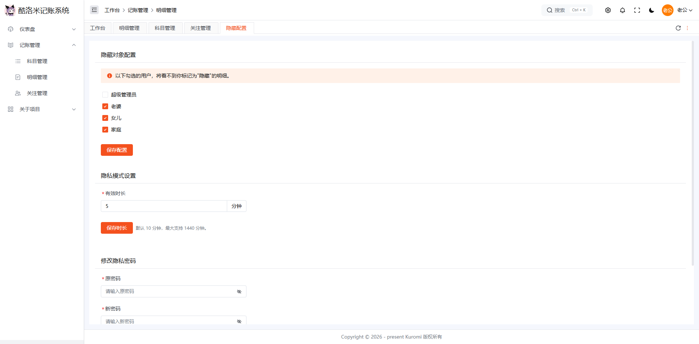

#### Web 端明细管理

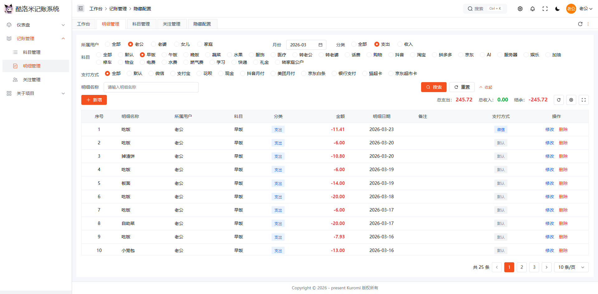

#### Web 端明细管理隐私模式

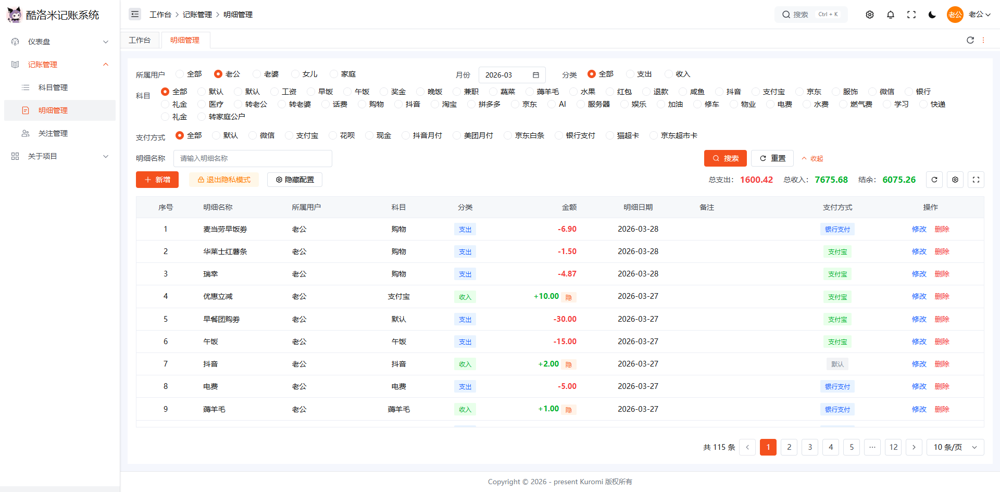

#### Web 端快捷专属登录链接

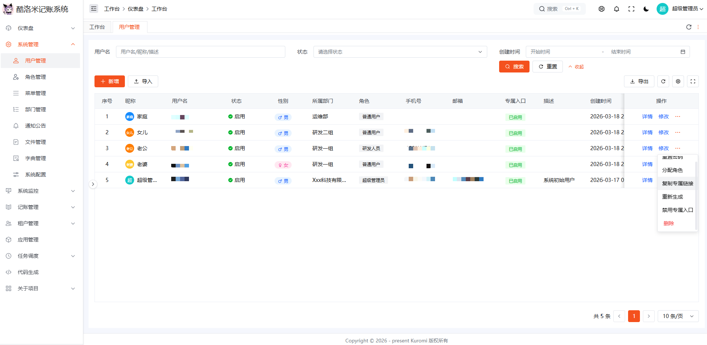

### 📱 移动端效果图

#### 移动端登录

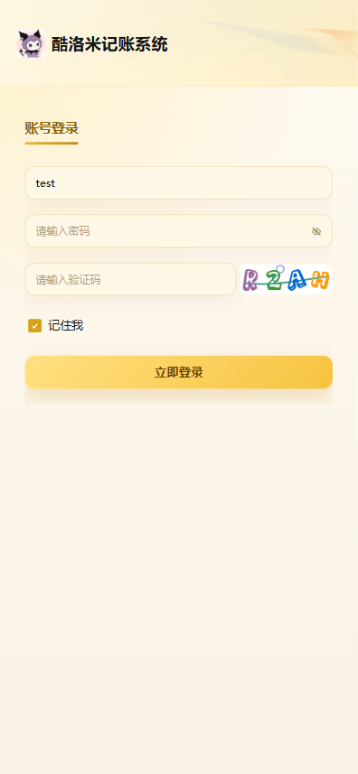

#### 移动端明细列表

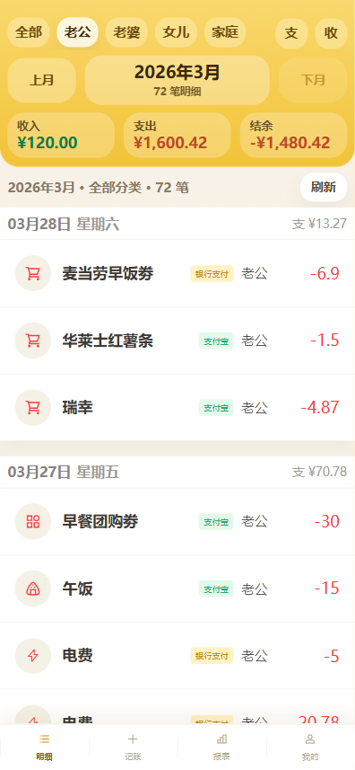

#### 移动端明细详情

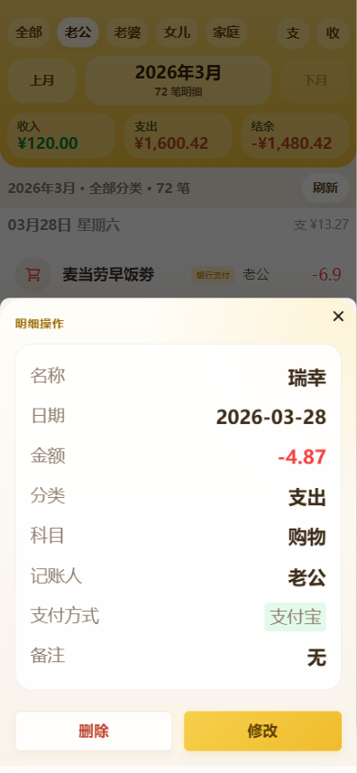

#### 移动端明细表单

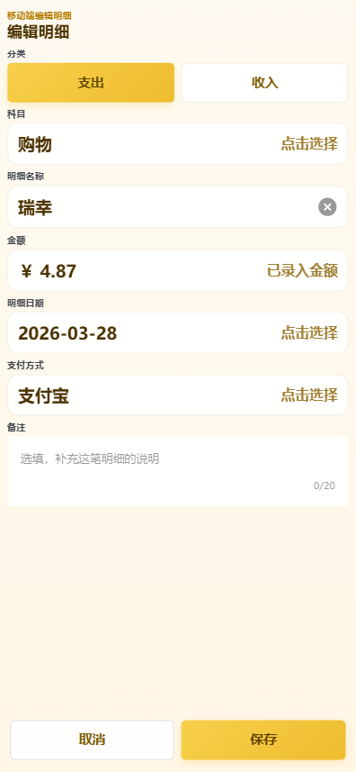

#### 移动端选择科目

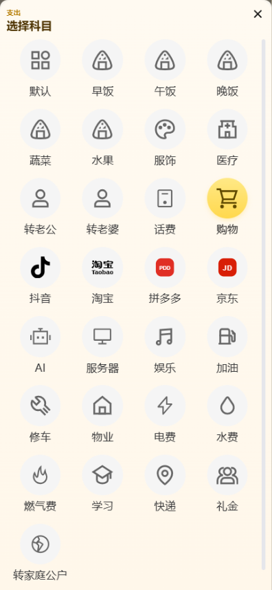

#### 移动端金额键盘

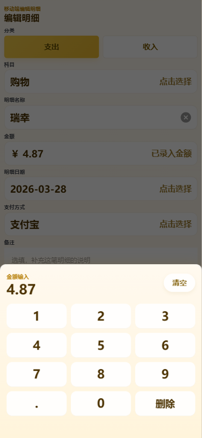

#### 移动端支付方式

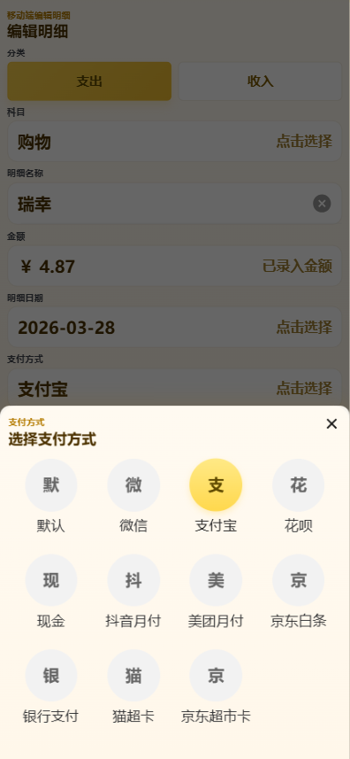

#### 移动端隐私模式

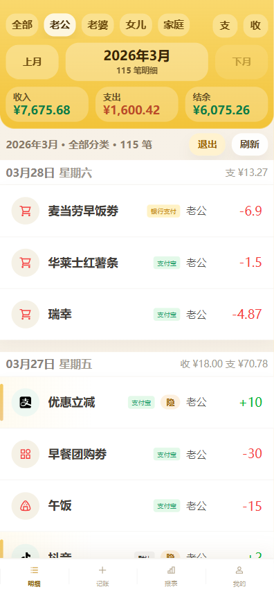

---

## 🚀 本地开发

建议环境：

1. Node.js 18+
2. pnpm

### 📦 安装依赖

```bash
pnpm i
```

或使用镜像源：

```bash
pnpm bootstrap
```

### ▶️ 启动开发环境

```bash
pnpm dev
```

默认访问地址：

1. Web：`http://localhost:5173`
2. 移动端：`http://localhost:5173/m/bookkeeping/detail`

### 🔍 类型检查

```bash
pnpm typecheck
```

### 🏗️ 打包

```bash
pnpm build
```

测试环境打包：

```bash
pnpm build:test
```

### 🧹 代码检查

```bash
pnpm lint
pnpm lint:fix
```

### 🔢 前端展示版本号递增

```bash
pnpm version:patch
pnpm version:minor
```

使用规则：

1. `patch`
   - 小范围修复或样式调整
2. `minor`
   - 阶段性功能升级

前端展示版本号统一维护在：

- `package.json` 的 `version`

移动端展示版本通过 `src/config/app-version.ts` 读取同一版本源。

---

## 🔗 与后端联调说明

默认联调端口：

1. 前端：`5173`
2. 后端：`8000`

当前前后端已打通的重点链路：

1. 账号密码登录与验证码链路
2. 专属入口登录链路
3. 专属入口静默续登链路
4. 用户管理中的专属入口启用、禁用、复制、重新生成
5. 在线用户中的登录方式展示
6. 记账明细、科目、科目标签、支付账号、关注、隐私、隐藏对象等业务链路
7. Web 报表中心、Web 日历报表、移动端报表链路

前端依赖的关键后端配置项：

1. `LOGIN_CAPTCHA_ENABLED`
   - 控制账号密码登录是否展示图形验证码
2. `SITE_FRONTEND_DOMAIN`
   - 用于生成用户专属快捷登录链接

---

## 📌 当前业务约定

### 1️⃣ Web 与移动端页面分离

约定如下：

1. 移动端页面不直接复用 Web 页面的表格与弹窗结构
2. 业务数据模型和 API 可复用
3. 页面布局和视觉样式分开维护

### 2️⃣ 移动端优先使用 TDesign Mobile Vue

`/m` 目录下页面默认遵循：

1. 优先使用 `TDesign Mobile Vue`
2. 非必要不新增原生按钮和原生弹层实现
3. 保持黄色主题和移动端统一风格

### 3️⃣ 专属入口与静默续登

当前前端专属入口链路约定如下：

1. 首次通过专属链接进入登录页后，会自动发起专属入口登录
2. 登录成功后，本地保存 `entryKey`
3. Token 正常过期时，HTTP 拦截器会尝试静默续登
4. 手动退出或被强制下线时，会清理本地专属入口信息

### 4️⃣ 当前报表能力边界

当前状态：

1. Web 端已支持报表中心和日历报表
2. 移动端已支持报表总览页
3. 移动端报表当前采用顶部 chips 筛选，重点支持时间预设、用户、支付账号
4. 移动端报表明确不支持“是否必要”筛选

---

## 📄 License

1. 遵循 Apache-2.0 协议
2. 基于 ContiNew Admin UI 二次开发
